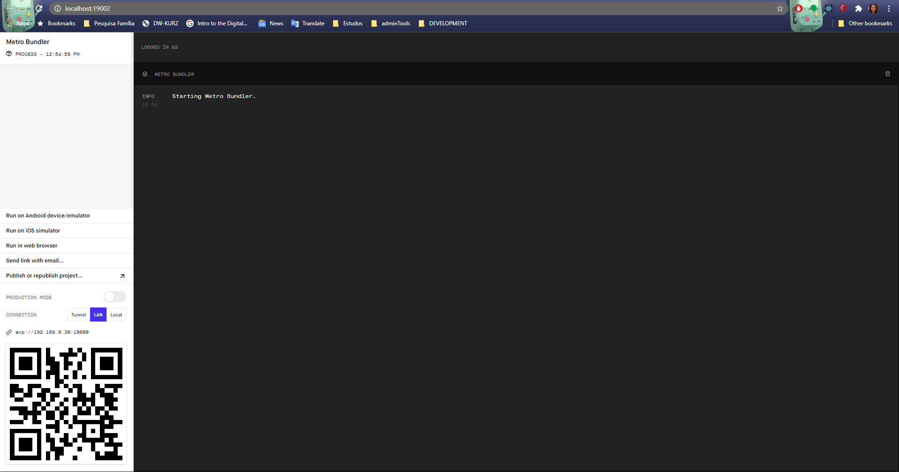
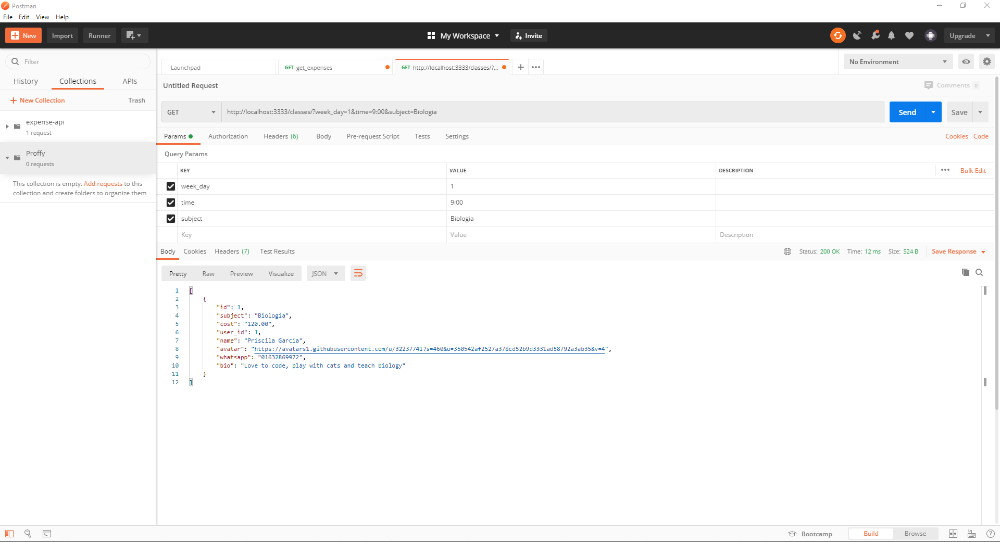
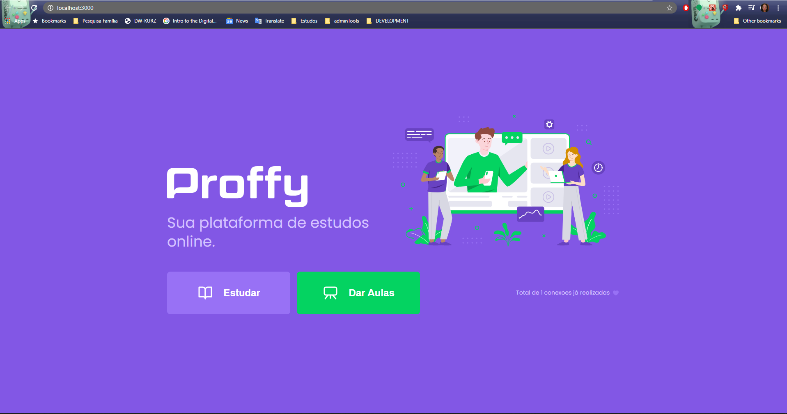

# Proffy - React application to allow students to connect with teachers for several topics


## :rocket: Thanks to [Rocketseat](https://rocketseat.com.br/) for providing this amazing 1 week bootcamp :clap:


:one: The first version includes tree solutions:


## :iphone: mobile: 

The mobile version of the Proffy application containing a landing page, a page for students to search for teachers and contact them directly via whatsapp.

### :package: Stack: 
* [react-native](https://reactnative.dev/)
* [axios](https://github.com/axios/axios)
* [typescript](https://www.typescriptlang.org/)
* [expo](https://expo.io/tools)
    
#### :information_source: How to run the mobile application at your local machine:

:wrench: First, install the required tools:

* [NodeJs](https://nodejs.org/en/download/)  
* [yarn](https://yarnpkg.com/getting-started/install):  
```
npm install -g yarn
```
* [expo-cli](https://expo.io/tools#cli):  
```
yarn global add expo-cli
```

#### :white_check_mark: Prepare your environment:

* :one: clone the repository from git
* :two: run:  
```
yarn install
```
* :three: run:  
```
yarn start 
```

#### :earth_africa: expo will automatically open the metro bundler at your default browser.




you can select the simulators or scan the QR code with your mobile phone, 
for that you will need to install expo at your mobile phone from the app store.


## :computer: server:


An api that allow us to record classes, connections, schedules and users and query proffys by filtering their time availability.

### :package: Stack: 

* [knex](http://knexjs.org/)
* [typescript](https://www.typescriptlang.org/) 
* [express](https://expressjs.com/)
* [postgresql](https://www.postgresql.org/) (on the rocketseat original class they used sqlite)

#### :information_source: How to run the api server at your local machine:

:wrench: First, install the required tools:

* [NodeJs](https://nodejs.org/en/download/)  
* [yarn](https://yarnpkg.com/getting-started/install): npm install -g yarn
* [postgresql](https://www.postgresql.org/download/)


#### :white_check_mark: Prepare your environment:

* :one: clone the repository from git
* :two: run:  yarn install
* :three: run: yarn start 

#### :tada: Now you are ready to consume some Proffy data from the api
###### :envelope: to test the http requests you can use one of the following tools:

* [Postman](https://www.postman.com/)
* [Insomnia](https://insomnia.rest/)

:envelope:by sending a GET request from your preferred tool to one of the available endpoints:

:email:GET: 
http://localhost:3333/classes
http://localhost:3333/connections

:outbox_tray:POST: 
http://localhost:3333/classes
http://localhost:3333/connections

Sample:


###### :x:you should get some empty response if you did not runned the Web app in order to create some classes, users or connections. But don't worry you can try that out by following the steps to set up the WebApp :arrow_down:

## :earth_americas: web: 

The web version of the proffy app, here we can access a beautiful landing page, apagefor "proffys" to record the classes they are offering, a page for students tosearch forproffys and contact them directly via whatsapp.

### :package: Stack: 
* [react-native](https://reactnative.dev/)
* [axios](https://github.com/axios/axios)
* [typescript](https://www.typescriptlang.org/)

#### :white_check_mark: Prepare your environment:

* :one: clone the repository from git
* :two: run:  yarn install
* :three: run: yarn start 

###### The app will open on your default browser, and now you are ready to Learn/Teach :wink:


*******************************        
###### Thanks to RocketSeat: 
The version 2 will be created as a challenge: 
* details are here: https://www.notion.so/Vers-o-2-0-Proffy-eefca1b981694cd0a895613bc6235970


